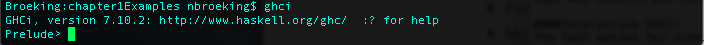
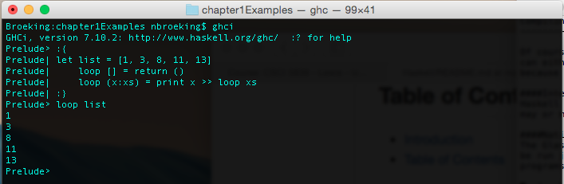

Compiling
---------

Of course just writing code is pretty useless unless we have a way to actually run it. With Haskell there is three major ways to run code. You can either run it in an interpreter, using the Haskell interactive shell, or compile it nativity. Both have their advantages and of course because we are two very nice guys we will show you both as well as talk about the advantages and disadvantages of both. 

####Interpreter 
Haskell has a very advanced interpreter, it is called RunHaskell and it can be invoked by calling RunHaskell <file>. The interpreter parses the code in real time and will perform JIT compiling. This means that the interpreter only compiles the code as it needs it. Of course there are pros and cons for using an interpreter in any language. It's easy and doesn't require mulitple files. You can just run the code without having to compile however it is really slow. Compiling the Haskell code will get you a huge speed up because it is compiled down to the machine code. 

####Natively Compile
Speaking of which, the Glasgow Haskell Compiler or ghc is the main Haskell compiler. It will compile Haskell down to native code and will create a binary that can be run just like any c, or c++ compiled program. Obviously, this has some major benefits because you will get some incredibly fast and efficient programs if they are run natively.  

To invoke the Glasgow Haskell Compiler first create a Haskell program.

```Haskell
main :: IO ()
main =
    let list = [1, 3, 8, 11, 13]
        loop [] = return ()
        loop (x:xs) = print x >> loop xs
        in
        loop list
```

You may recognize this example from the previous slide. This is just a basic function that prints the contents of a list. Now we are ready to compile this program using the GHC compiler. We run ghc -w -o basicHaskell2 basicHaskell2.hs. This will output three files. 

*basicHaskell2.hi - This is the interface file that gets generated by the Haskell Compiler. What is a interface file you may ask. Well, you can think of it like the .h file for c except that the Haskell compiler is nice enough to generate it for you. If you open the file though you may notice that there is binary characters and a whole lot of nasty stuff that your word processor probably just got very mad at you for trying to open. Thats because this header file isn’t meant for us its for the compiler to help it with the building process.  

*basicHaskell2.o - This is the object file. This is no different than any .o file created by gcc. It has all Haskell code but converted into binary before the linking step. 

*basicHaskell2 - Finally this is the binary that you can run. It is executable and behaves just like any other binary except that the originating code was Haskell and not C which probably many of you are used to. 

Once these have been compiled running the code is very easy. Just enter ./basicHaskell2 and you will see the code run.

  

####Interactive Shell
The last option for running Haskell code is by using the Glasgow Haskell Compiler Interactive or GHCI. If you type GHCI in the command line you will get a interactive prompt for you to run Haskell code.

Lets walk through a quick example first run ghci you should see something that looks an awful lot like



Once the shell is open then we can enter the code from basicHaskell2.hs line by line

  

The code will run exactly the same and as you can see we get the list printed out. If you looked closely, or actually read what we are talking about you will notice one major difference. In the interactive shell needs :{ :} to enter in a block statement. Other than this small detail everything is exactly the same.


<!---
At the bottom of every page we need a next and previous button 
-->
<hr>
[Home](../../README.md) | [Back](BasicHaskell.md) | [Next](../Chapter2/BasicTypes.md)

